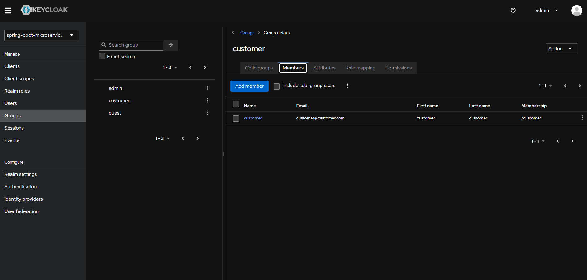
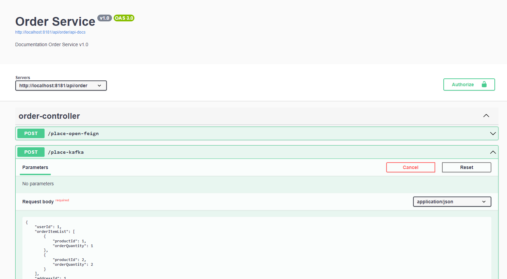
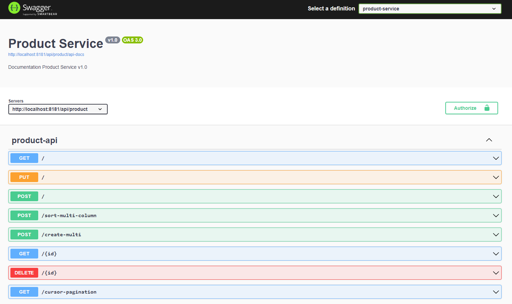
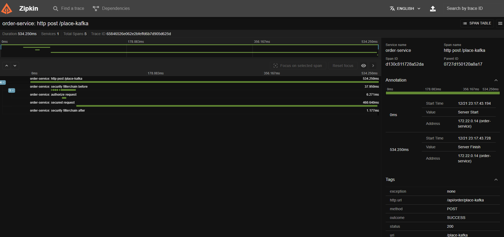
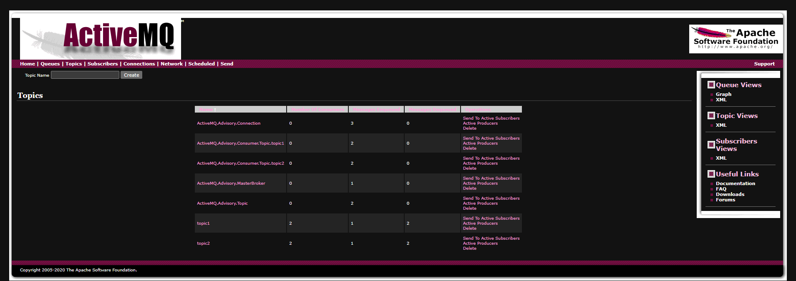
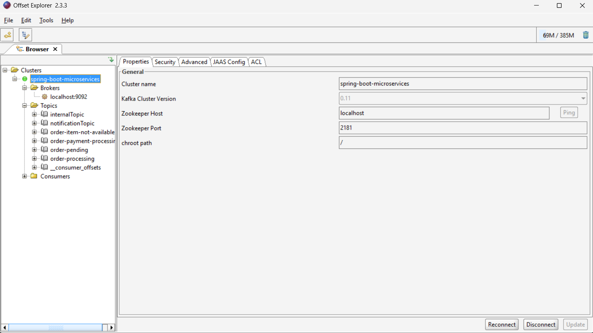

# spring-boot-microservices

## List what has been used

- [Spring Boot](https://spring.io/projects/spring-boot) web framework, makes it easy to create stand-alone,
  production-grade Spring based Applications
- [Apache Kafka](https://kafka.apache.org/) distributed and fault-tolerant stream processing system.
- [Spring Cloud Netflix Eureka](https://spring.io/projects/spring-cloud-netflix) service discovery, 
allows services to find and communicate with each other without hard-coding the hostname and port
- [Spring Cloud Gateway](https://spring.io/projects/spring-cloud-gateway) api gateway, provide a simple, yet effective
  way to route to APIs and provide cross-cutting concerns to them such as: security, monitoring/metrics, and resiliency.
- [Resilience4j](https://github.com/resilience4j/resilience4j) library, helps prevent cascading failures
  and provides mechanisms for graceful degradation and self-healing when external services experience issues
- [Zipkin](https://zipkin.io/) distributed tracing system, provides end-to-end visibility into how requests flow through the system, 
helping troubleshoot issues in distributed architectures
- ~~Spring Cloud Sleuth, autoconfiguration for distributed tracing~~
- [Micrometer Tracing](https://micrometer.io/docs/tracing) with Brave, library for distributed tracing (update to Spring Boot 3.x)
- [Docker](https://www.docker.com/) and docker-compose, for containerization
- [Spring Data JPA](https://spring.io/projects/spring-data-jpa) provides repository support for the Jakarta Persistence API
- [Flywaydb](https://flywaydb.org/) for migrations
- [Keycloak](https://www.keycloak.org/) for providing authentication, user management, fine-grained authorization
- [PostgreSQL](https://www.postgresql.org/)

## Prerequisite

- Java 17
- Maven
- Docker
- GNU Make
- WSL (if using Windows)

## Setup

- Microservice repositories
    - spring-boot-microservices : https://github.com/ericdaniel6166/spring-boot-microservices
        - shared configuration files, components, etc. that can be reused in other microservices (order-service,
          inventory-service, etc)
    - discovery-server : https://github.com/ericdaniel6166/discovery-server
    - api-gateway : https://github.com/ericdaniel6166/api-gateway
    - product-service : https://github.com/ericdaniel6166/product-service
    - order-service : https://github.com/ericdaniel6166/order-service
    - inventory-service : https://github.com/ericdaniel6166/inventory-service
    - payment-service : https://github.com/ericdaniel6166/payment-service
    - notification-service : https://github.com/ericdaniel6166/notification-service

- Make sure microservice repositories at directory as below, otherwise should change this for dev-environment setup

```bash
.
├── spring-boot-microservices
├── discovery-server
├── api-gateway
├── product-service
├── order-service
├── payment-service
├── inventory-service
└── notification-service
```

## Running the app

##### Run command in spring-boot-microservices directory

- Docker environment

```bash
# Docker compose up
make up

# Docker compose down
make down
```

- Non Docker / standalone environment

```bash
# Docker compose up
make local-up

# Start discovery-server, api-gateway

# Start microservice   

# Docker compose down
make local-down
```

#### Keycloak
##### Adding to host file
```bash
127.0.0.1   keycloak
```
##### Admin console
- Non Docker / standalone environment
  http://localhost:8090/
  admin/admin
- Docker environment
  http://keycloak:8090/
  admin/admin
- 
##### Get access token
- Non Docker / standalone environment
```bash
POST http://localhost:8090/realms/spring-boot-microservices-realm/protocol/openid-connect/token
#Basic Auth
Username="microservice-auth"
Password="123456789"
#form data
grant_type="client_credentials"
scope="openid"
```
- Docker environment
```bash
POST http://keycloak:8090/realms/spring-boot-microservices-realm/protocol/openid-connect/token
#Basic Auth
Username="microservice-auth"
Password="123456789"
#form data
grant_type="client_credentials"
scope="openid"
```

##### Swagger

http://localhost:8181/swagger-ui.html


##### Zipkin
http://localhost:9411/

##### ActiveMQ
http://localhost:8161/
admin/admin

##### Apache Kafka
- Using [Offset Explorer](https://www.kafkatool.com) - a GUI application for managing and using Apache Kafka clusters

## Sequence diagrams (Updating...)

- Using [mermaid.live](https://mermaid.live/)
  [](https://mermaid.live/edit#pako:eNrVV11v2jAU_SuWn4oaKsI3eajEVrQhtVAVNGkTUuQmlzYisVniRKNV__ucOHzkw0DQHrq-NFz7nHvse66dvGOL2YANHMDvEKgFdw558Ym3oEj8Wa4DlNdvb6-Zb4NfD8CPHAsMtHaJBVdJ8CkGBrwmEZl5ApjDRcR1bMIhBZ3NYKa_TfvZQAGJYBpHr2pIYijjgFgEfhatoTwYSTTiZjKioYATHgbocTS5G0--LWhlDbOE4LsTcOZvrmoX6knjCZf5KsmK4gRzub4VWa6IoAJqyy19FE8OfRlFonyl-ypAdVldQ47IdZyQX4LIqEvlOTTOK5ZQlGgxGoQeKFUSizuRMEiR41SC610wU6gX4OPtwJguWbFEBTINKanQ0mfeflhDa5_ZocVzsg5gyU4XUhj7ubGore_K1lWC3XbRmIM3jIjjkmcX4oWle-hy5ARyloycKMqBb3xmQRDkiqK2XLacSvCuqhkWNfl1oeHCdbzgtOv3wCqNJimKrf80_TqazXYW3rvsPGXHT4JKIo0zzoKjam1Q7bScA24AsTWEoovsERtuwvjOc_k6H-RX9O-ZVjqV6DMbajwfPZiT6dwc_hiO74df7kf_g7HOU602WGIvaqPtMS3_r8nGi98g0mmoysGxy5QjKWUWxLmIYRHXCt18kZW4_HY9ynDxvsgxaKhIsL3W05F99w5_PowmczPfxVVFnXjpqK5QedycLbh4lcgp5bU98FFpdTPmUrnmWIJjNr3ocPgXN41iMz_Z26ZCpar1sYY98D3i2OIr4j2eu8D8FTxYYEM82sRfLfCCfoh5JORstqEWNpZE3EQalhuVfnLsomtCsfGO_2CjrjcaN_2u3tGb7Va3rfcaXQ1v4ni3dzNo9Dvdfr_VHDSbrdaHht8YEyT6Ta-nd7p6uzVottpt8aBhsB2xxgf5pZN88CRZfiUA7ofw8Rer1Iu2)

```
sequenceDiagram
    client->>+order-service: place(orderRequest)
    order-service->>order-service: validateRequest(orderRequest)
    order-service->>order_service_db: saveOrder() 
    note over order-service, order_service_db : save t_order, status PENDING

    order-service->>order_service_db: saveOrderStatusHistory()
    note over order-service, order_service_db : save order_status_history, status PENDING
   
    order-service->>kafka: send(orderPendingEvent)
    order-service-->>-client: orderStatus
    note over order-service, client: orderStatus PENDING
    
    inventory-service->>kafka: consume(orderPendingEvent)
    activate inventory-service
    
    inventory-service->>+inventory_service_db: getInventoryInfo()
    note over inventory-service, inventory_service_db: get from inventory, product
    inventory_service_db-->>-inventory-service: inventoryInfo

    inventory-service->>inventory-service: validateItemAvailable()

    alt is valid
        inventory-service->>kafka: send(orderProcessingEvent)
        order-service->>kafka:consume(orderProcessingEvent)
        activate order-service
        order-service->>+order_service_db:updateOrder()
        note over order-service, order_service_db : update t_order, status PROCESSING
        
        order-service->>+order_service_db:saveOrderStatusHistory()
        note over order-service, order_service_db:save order_status_history, status PROCESSING
        
        deactivate order-service

    else is not valid
        inventory-service->>kafka: send(orderItemNotAvailableEvent)
        deactivate inventory-service
        order-service->>kafka:consume(orderItemNotAvailableEvent)
        activate order-service
        order-service->>+order_service_db:updateOrder()
        note over order-service, order_service_db : update t_order, status ITEM_NOT_AVAILABLE
        
        order-service->>+order_service_db:saveOrderStatusHistory()
        note over order-service, order_service_db:save order_status_history, status ITEM_NOT_AVAILABLE
        
        deactivate order-service
    end 
    

    payment-service ->>kafka:consume(orderProcessingEvent)
    activate payment-service
    payment-service->>payment-service:calculateOrder()
    payment-service->>payment_service_db:savePayment()
    note over payment-service, payment_service_db : save payment, status PAYMENT_PROCESSING
    payment-service->>payment_service_db:savePaymentStatusHistory()
    note over payment-service, payment_service_db : save payment_status_history, status PAYMENT_PROCESSING
    payment-service->>kafka: send(orderPaymentProcessingEvent)
    deactivate payment-service
    order-service ->>kafka:consume(orderPaymentProcessingEvent)
    activate order-service
    order-service->>+order_service_db:updateOrder()
    note over order-service, order_service_db : update t_order, status PAYMENT_PROCESSING
    order-service->>order_service_db: saveOrderStatusHistory()
    note over order-service, order_service_db : save order_status_history, status PAYMENT_PROCESSING
    deactivate order-service
```

[](https://mermaid.live/edit#pako:eNp9kc1OwzAQhF-l2hOIJLITO8E-9MQVcegNRaqMvZSIxi6OgyhR3h0n4a8VYk-r0Xw7a-8A2hkECR2-9Gg13jRq51Vb21UsvW_QhnS9vnLeoE879K-NRrnaYbiblE1Qoe8uLhf7iemb2n4KW_Mg_-F-2dLIpmeJ7gf7K2wilm1PrJBAi75VjYlPHCawhvCELdYgY2uUf66htmP0qT64zdFqkMH3mEB_MCp8fQfIR7XvonpQFuQAbyAFz2hBCeM5o9dElGUCR5A0z_KqKgWlpCoZy6tiTODduTiBZGIpRgrBC87zBNA0wfnb5QTzJeaI-xmY9hg_AKxjiFc)
```
sequenceDiagram
    client->>+order-service: getOrderStatus()
    order-service->>+order_service_db:getOrderStatus()
    order_service_db-->>-order-service: orderStatus
    order-service-->>-client: orderStatus
```

