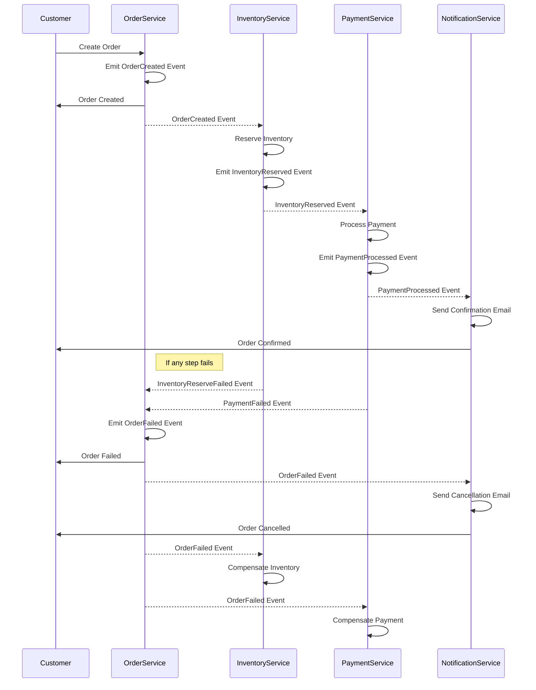
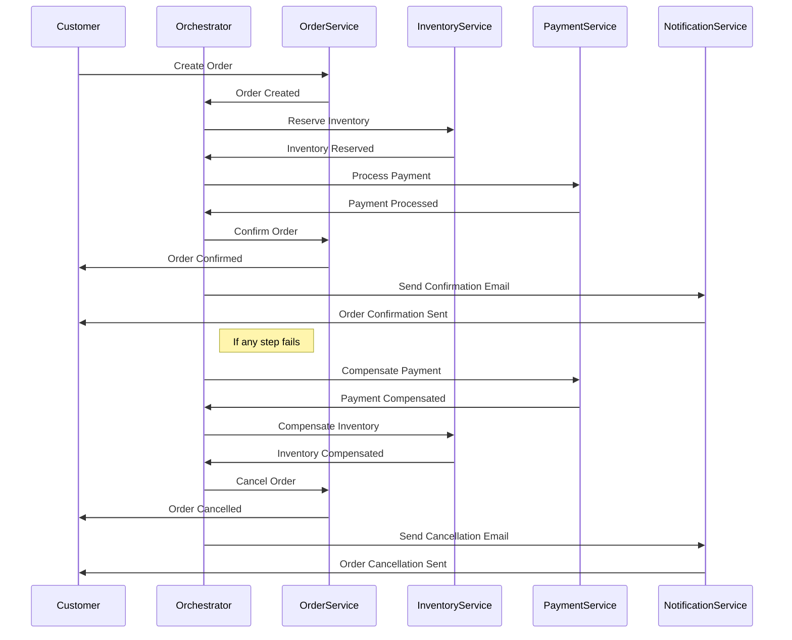

# spring-boot-microservices

## Sequence Diagram

#### Choreography-based Saga


#### Orchestration-based Saga



## List what has been used

- [Spring Boot](https://spring.io/projects/spring-boot), web framework, makes it easy to create stand-alone,
  production-grade Spring based Applications
- [Apache Kafka](https://kafka.apache.org/), distributed and fault-tolerant stream processing system.
- [Spring Cloud Netflix Eureka](https://spring.io/projects/spring-cloud-netflix), service discovery, 
allows services to find and communicate with each other without hard-coding the hostname and port
- [Spring Cloud Gateway](https://spring.io/projects/spring-cloud-gateway), api gateway, provide a simple, yet effective
  way to route to APIs and provide cross-cutting concerns to them such as: security, monitoring/metrics, and resiliency.
- [Spring Data Redis](https://docs.spring.io/spring-data/redis/reference/redis/redis-cache.html), provides an implementation of Spring Framework’s Cache Abstraction
- [Spring Integration](https://docs.spring.io/spring-integration/reference/mqtt.html), provides inbound and outbound channel adapters to support the Message Queueing Telemetry Transport (MQTT) protocol.
- [Resilience4j](https://github.com/resilience4j/resilience4j), library, helps prevent cascading failures
  and provides mechanisms for graceful degradation and self-healing when external services experience issues
- [Zipkin](https://zipkin.io/), distributed tracing system, provides end-to-end visibility into how requests flow through the system, 
helping troubleshoot issues in distributed architectures
- ~~Spring Cloud Sleuth, autoconfiguration for distributed tracing~~
- [Micrometer Tracing](https://micrometer.io/docs/tracing) with Brave, library for distributed tracing (update to Spring Boot 3.x)
- [Docker](https://www.docker.com/) and docker-compose, for containerization
- [Spring Data JPA](https://spring.io/projects/spring-data-jpa) provides repository support for the Jakarta Persistence API
- [Flywaydb](https://flywaydb.org/) for migrations
- [Keycloak](https://www.keycloak.org/) for providing authentication, user management, fine-grained authorization
- [PostgreSQL](https://www.postgresql.org/)

## Prerequisite

- Java 17
- Maven
- Docker
- GNU Make
- WSL (if using Windows)

## Setup

- Microservice repositories
    - spring-boot-microservices : https://github.com/ericdaniel6166/spring-boot-microservices
        - shared configuration files, components, etc. that can be reused in other microservices (order-service,
          inventory-service, etc)
    - discovery-server : https://github.com/ericdaniel6166/discovery-server
    - api-gateway : https://github.com/ericdaniel6166/api-gateway
    - user-service : https://github.com/ericdaniel6166/user-service
    - product-service : https://github.com/ericdaniel6166/product-service
    - order-service : https://github.com/ericdaniel6166/order-service
    - inventory-service : https://github.com/ericdaniel6166/inventory-service
    - payment-service : https://github.com/ericdaniel6166/payment-service
    - notification-service : https://github.com/ericdaniel6166/notification-service

- Make sure microservice repositories at directory as below, otherwise should change this for dev-environment setup

```bash
.
├── spring-boot-microservices
├── discovery-server
├── api-gateway
├── user-service
├── product-service
├── order-service
├── payment-service
├── inventory-service
└── notification-service
```

## Running the app
##### Adding to host file
```bash
127.0.0.1   keycloak
```
##### Run command in spring-boot-microservices directory

- Docker environment

```bash
# Docker compose up
make up

# Docker compose down
make down
```

- Non Docker / standalone environment

```bash
# Docker compose up
make local-up

# Start discovery-server, api-gateway, user-service

# Start microservice   

# Docker compose down
make local-down
```

#### Keycloak

##### Admin console
```bash
Non Docker / standalone environment: http://localhost:8090/

Docker environment: http://keycloak:8090/

username/password

admin/admin
```

##### Get access token
```bash
Non Docker / standalone environment: POST http://localhost:8090/realms/spring-boot-microservices-realm/protocol/openid-connect/token

Docker environment: POST http://keycloak:8090/realms/spring-boot-microservices-realm/protocol/openid-connect/token
#Basic Auth
Username="microservices-auth-client"
Password="123456789"
#form data
'grant_type="password"'
'scope="openid offline_access"'
'username="admin"'
'password="P@ssw0rd"'
```
- Account
```bash
username/password

admin/P@ssw0rd
customer/P@ssw0rd
guest/P@ssw0rd
```
##### Swagger
```bash
http://localhost:8181/swagger-ui.html
```


##### Zipkin
```bash
http://localhost:9411/
```

##### ActiveMQ
```bash
http://localhost:8161/

username/password

admin/admin
```

##### Apache Kafka
- Using [Offset Explorer](https://www.kafkatool.com) - a GUI application for managing and using Apache Kafka clusters
```bash
Cluster name: spring-boot-microservices
Zookeeper Host: localhost
Zookeeper Port: 2181
```

